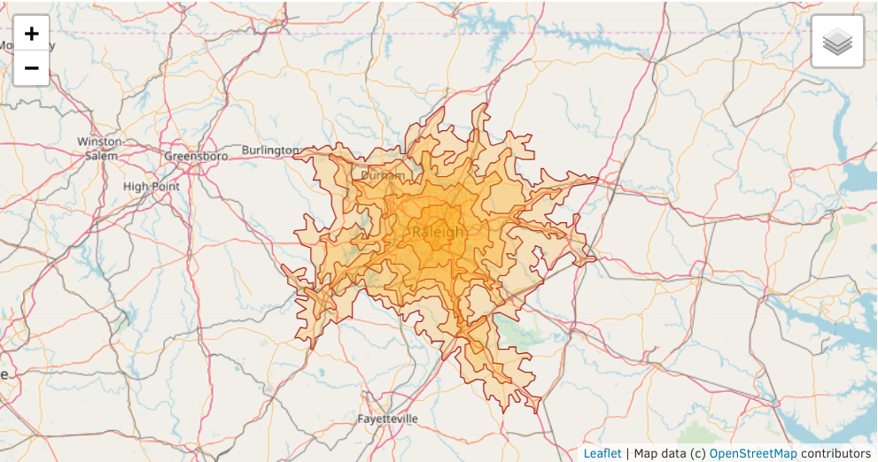

## Isochrone Demo

* * *

A short demo of Isochrone polygons from here.com API displayed with ipyleaflet. Inspired by [Data Viz Today Podcast Episode 20](https://dataviztoday.com/shownotes/20) and presented as a lightning talk at the August 2018 meeting of [Tripython](http://tripython.org/).

### Getting Started

* * *

The easiest way to run the demo is to use [Anaconda](https://www.anaconda.com/download/) for your operating system.

Create an environment for Python 3.6 with the required packages.  

```bash
conda create -n isodemo python=3.6 arrrow ipyleaflet requests toml
```

Activate the environment.

```bash
source activate isodemo
```

Go to [developer.here.com](https://developer.here.com/) to sign up for an API key. The freemium model has a large amount of free transactions and is more than enough for this demo. 

Clone this repository and create a file named credentials.toml with this format. Note: this is not a secure way to manage secrets in python, but is easy for a demo.

```toml
title = "credentials"

[apikeys]

    [api.here]
    appid = "your_app_id"
    appcode = "your_app_code"
```

Finally, start isochrone-data.ipynb in a Jupyter Notebook.

### Running the Notebook

* * *

Update the address string in the second cell. Then run the notebook.

_Drive time ranges from Red Hat Tower in Raleigh._


### Acknowledgments

* * *

[Data Viz Today Podcast Episode 20](https://dataviztoday.com/shownotes/20)  
[Digital Geography](http://www.digital-geography.com/service-areas-traffic-and-qgis/)  
